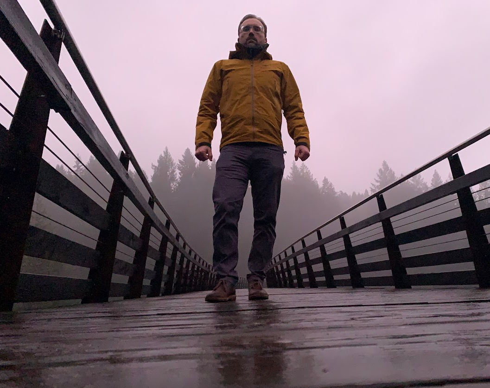
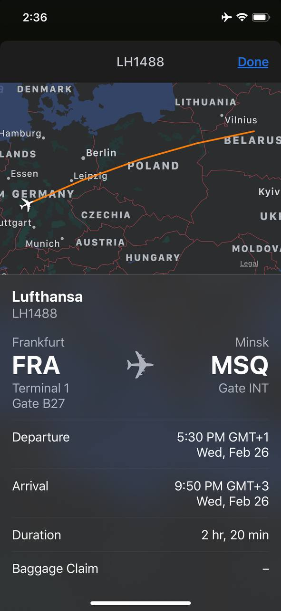
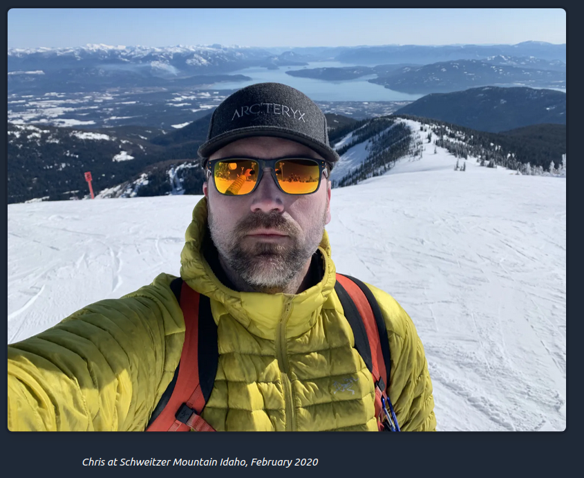
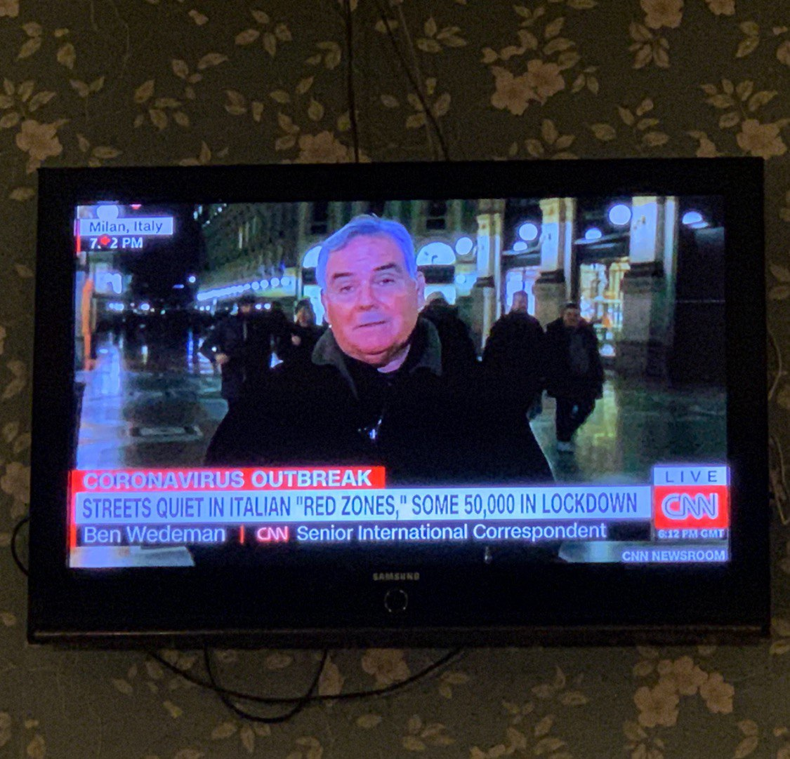
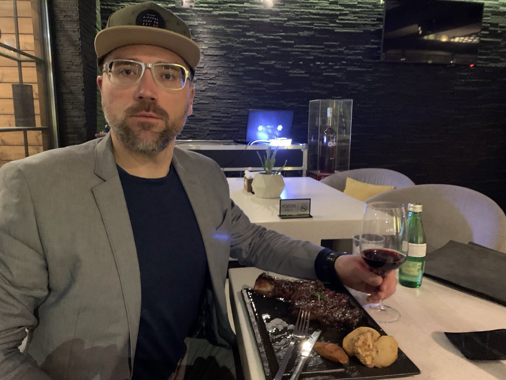

# Anatomy of a Preemptive Strike
_Find the best location(s) in North America for a base during what became the Scandemic._  
_Then find the best location(s) for a base in Europe before movement becomes more difficult._

Part 1: Find the best location(s) in North America for a homebase during what became the Scandemic.  
Part 2: New travel documents  
Part 3: Find the best location(s) for a homebase in Europe.

Part 1.  
THE SEARCH 

When the search began I happened to be in transit from Victoria British Columbia to Duncan British Columbia on one of the largest, most rugged islands in the world.

While only briefly in Duncan, I meditated on North Idaho and Montenegro. Around the same time, a friend of mine was very interested to visit Moldova. 

Long on my to-do list, I drove to Coeur d' Alene Idaho to investigate what this area and nearby Sandpoint Idaho could be like for long-term living.
(later on it became widely known that these were some of the most livable places in North America during the times of the Scandemic)

Part 2.  
DOCUMENTS  
In February, I went for Express Passport Renewal. My current document (at that time) was going to expire in less than 1 year. Who knows how long things could drag on for? I could not be blocked from travel or using it as a photo ID in some remote location because of some 'technicalities'. I got the new document in less than a week. I took my Father out for his 78th Birthday while waiting for the new passport to arrive.

Part 3.  
EXECUTION  
As agreed, in late February, I met with my friend that had been keen to visit Moldova at one of his bases in Minsk Belarus. 

Once I arrived in Minsk, we would take a low cost, direct flight to Chisinau Moldova for a through examination. While in Chisinau we would make an attempt at a short side trip to nearby but not widely recognized Transnistria. "Seeking Recognition"
On our first attempt we got rejected by the border guards for no apparent reason. Later on, we would enter via the Smugglers Route and have a succesful visit to Bendery and Tiraspol.

Highlight of this Mens Trip:  
February 29, 2020 dinner at the appropriately named, "Propoganda Cafe".  
A single TV on the wall _only_ plays CNN.  

Headlines scrolling on the bottom ticker during dinner:  
_"CORONAVIRUS OUTBREAK: Streets quiet in Italian Redzones. Some 50,000 in lockdown."_

...While we were sitting in a nice cafe drinking delicious and affordable Moldovan red wine with our beef dinners. 

After we had completed much of the basic exploration of Chisinau my friend decided to return to his base in Belarus, but I stayed behind to explore a little deeper and check out the largest wine cellar in the world. Around 40KM of large underground tunnels and vino casas housing private wine collections from people all over the world.

Shortly thereafter things were heating up with regard to the Scandemic. I decided to return to Belarus with the bulk of the winter over now and hearing that the Presdent had rejected an 800 Million USD I.M.F. bribe to enforce a lockdown on the citizens and residents.

It seemed like a great place to be for some time. In April 2020, I began setting up a homebase in the south in a former Polish city, 200 KM from Warsaw, named Brest Belarus.

Later on in summer 2020, I discovered _direct charter flights_ between Minsk and Tivat Montenegro. Upon arrival to nearby Kotor, I found that like in Belarus, many people did not care about the Scandemic, so I was exploring ME for 1.5 months, primarily on foot and via a 1995 Yamaha Tenere motorcycle.  
https://www.instagram.com/p/CF6uhpjAYJ9/

In October I returned to Brest Belarus for the remainder of 2020.

SUMMARY:  
- Mapping out highly livable places nearby to where I was already at in December 2019, gave me some time advantage.
- Moving onto less well known and less studied locations in Europe also gave me advantage of gaining first hand insights, rather than speculation and 2nd hand reports.
- IF I was for some reason, after multiple attempts and failures in various Europe locations, I was forced to return to the country of my Citizenship... based on my early evidece collection in North Idaho, I would have a good target to aim for.

Images for referance are included below.  
Hope you enjoyed this report.
@roundtheworldman

